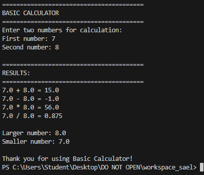
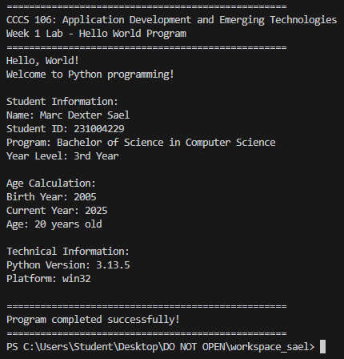
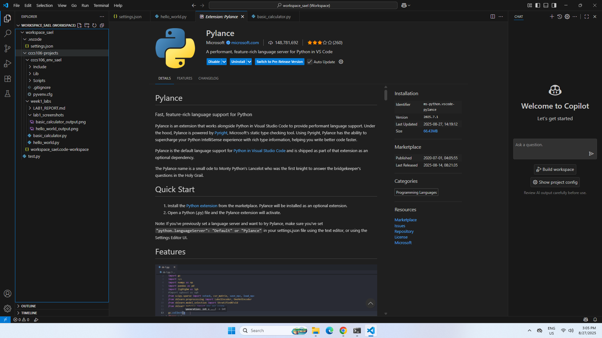

**Student Name:** Marc Dexter Sael
**Student ID:** 231004229
**Section:** BSCS 3B
**Date:** 8/27/2025

## Environment Setup

### Python Installation
- **Python Version:** [e.g., 3.11.5]
- **Installation Issues:** [Describe any problems and solutions]
- **Virtual Environment Created:** ✅ cccs106_env_sael

### VS Code Configuration
- **VS Code Version:** [e.g., 1.82.0]
- **Python Extension:** ✅ Installed and configured
- **Interpreter:** ✅ Set to cccs106_env_sael/Scripts/python.exe

### Package Installation
- **Flet Version:** 0.28.3
- **Other Packages:** [List any additional packages]

## Programs Created

### 1. hello_world.py
- **Status:** ✅ Completed
- **Features:** Student info display, age calculation, system info
- **Notes:** None

### 2. basic_calculator.py
- **Status:** ✅ Completed
- **Features:** Basic arithmetic, error handling, min/max calculation
- **Notes:** None

## Challenges and Solutions

The challenge i faced was understanding errors in my code, but i solved it by carefully reading error messages and practicing more.

## Learning Outcomes

I learned that python is easy to use, development environments help organize and test codes.

## Screenshots

